# 🛍️ Baghdad Shop - Advanced E-Commerce Management System

<div align="center">


</div>

---

## 🌟 Overview: A Powerful Dual-Sided Platform

Baghdad Shop is a high-performance e-commerce ecosystem built to provide a premium experience for both **Customers** and **Store Administrators**. From advanced product management to a seamless checkout flow, every detail is engineered for scalability and professional UX.

---

## 📸 Visual Journey & System Modules

### 🖥️ The Command Center (Admin Desktop)

_Mastery of data management and real-time business analytics._

|         Global Statistics & Recent Activity          |              Advanced Inventory Management               |
| :--------------------------------------------------: | :------------------------------------------------------: |
| 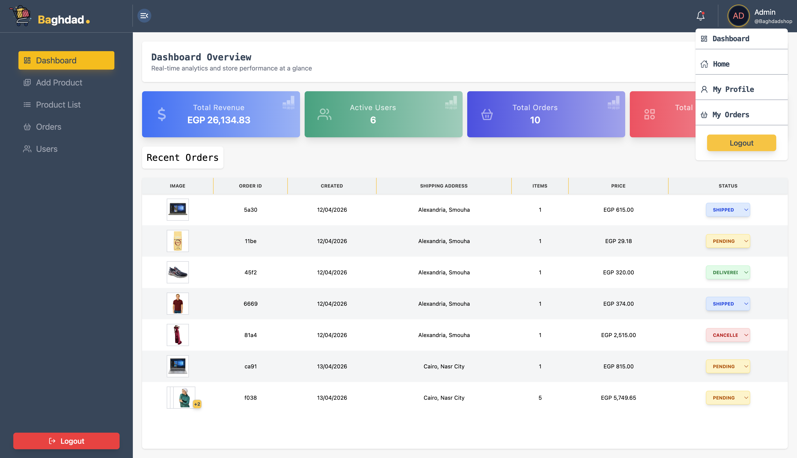 | 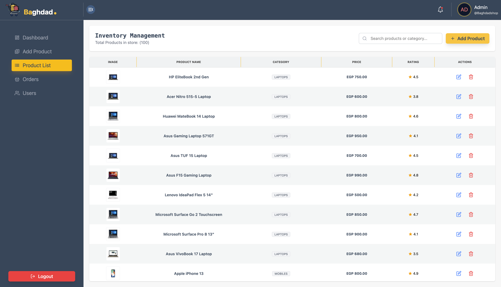 |
|         _Real-time revenue & user tracking_          |       _Full CRUD operations with search & filters_       |

|                       User Governance                       |            Product Orchestration (Add/Edit)            |
| :---------------------------------------------------------: | :----------------------------------------------------: |
| 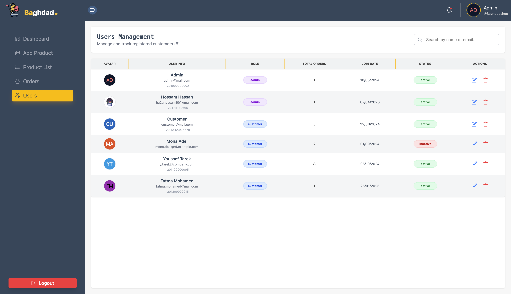 | 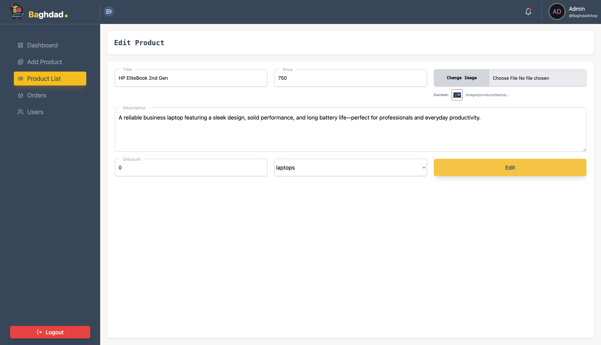 |
|           _Role management (Admin first sorting)_           |       _Responsive forms with live image preview_       |

---

### 👤 The Personalized Hub (Customer Desktop)

_Clean, intuitive, and conversion-focused shopping experience._

|               Storefront & Discovery               |                   Intelligence in Filtering                   |
| :------------------------------------------------: | :-----------------------------------------------------------: |
|  | 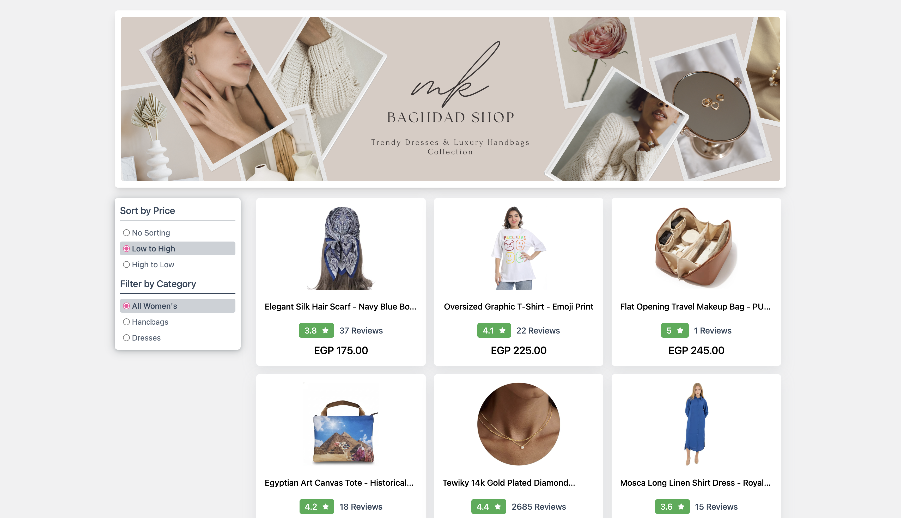 |
|          _Modern Hero & Product Sliders_           |      _Sorting by effective price (Post-discount logic)_       |

|                 Smart Cart & Checkout                  |                  Transparent Order History                  |
| :----------------------------------------------------: | :---------------------------------------------------------: |
| 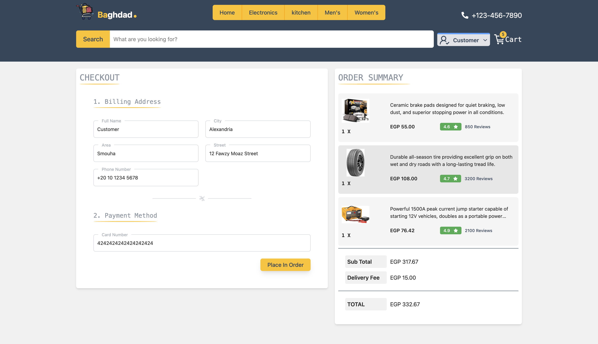 | 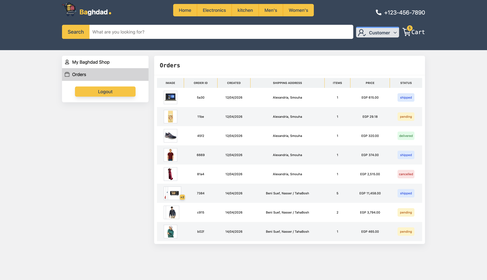 |
|         _Address validation & Secure checkout_         |           _Visual "Stacked Image" order previews_           |

---

### 📱 Mobile-First Excellence

_Engineered for performance and accessibility on small screens._

|                  Home Interface                  |                    User Navigation                     |                     Admin Analytics                     |                       Admin Navigation                       |
| :----------------------------------------------: | :----------------------------------------------------: | :-----------------------------------------------------: | :----------------------------------------------------------: |
| 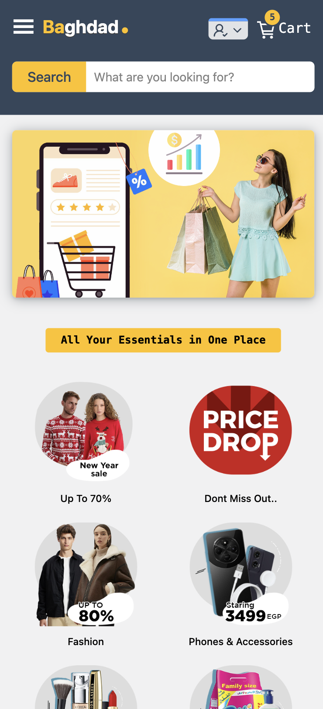 | 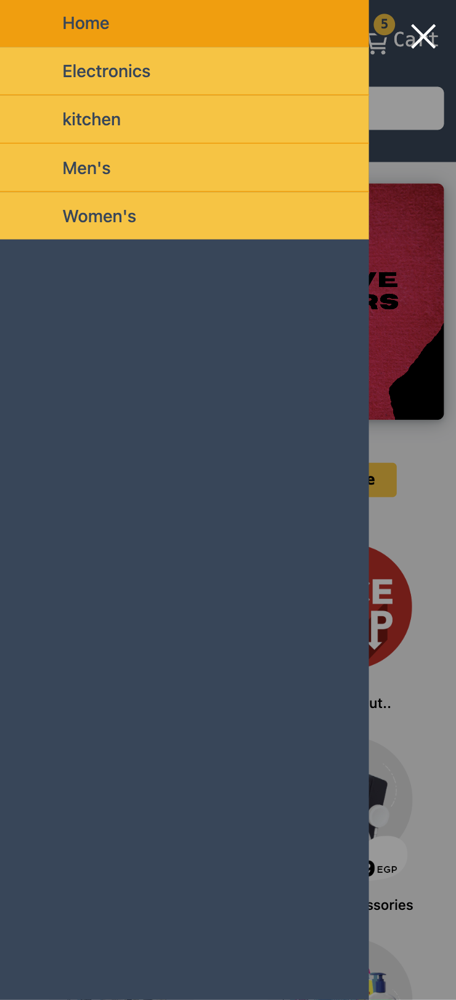 | 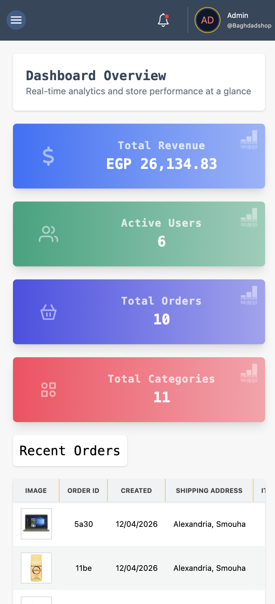 | 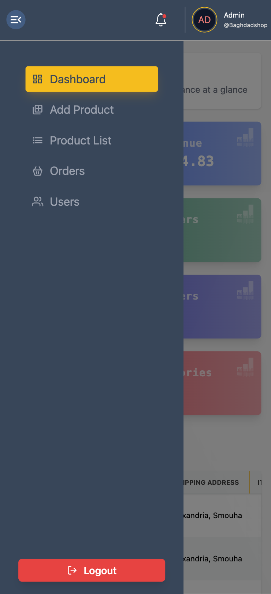 |
|                  _Fluid Layout_                  |                  _Contextual Sidebar_                  |                    _Dashboard Cards_                    |                       _Admin Controls_                       |

---

### 🔐 Security & Identity Module

|              Secure Entrance               |               Account Creation                |                   Access Recovery                   |
| :----------------------------------------: | :-------------------------------------------: | :-------------------------------------------------: |
| 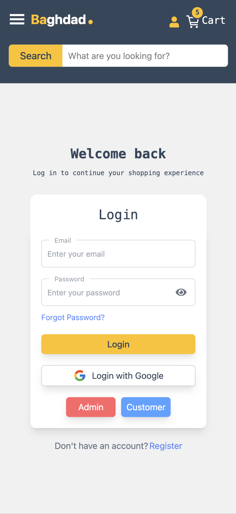 | 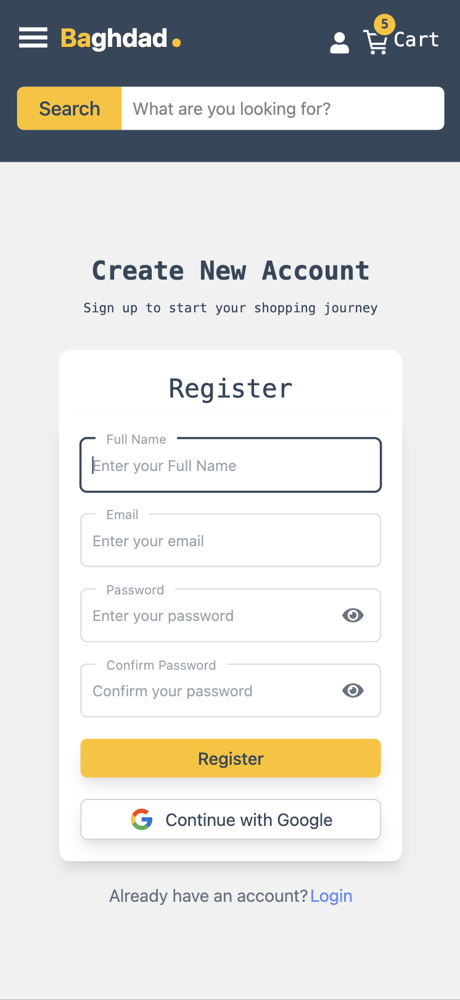 | 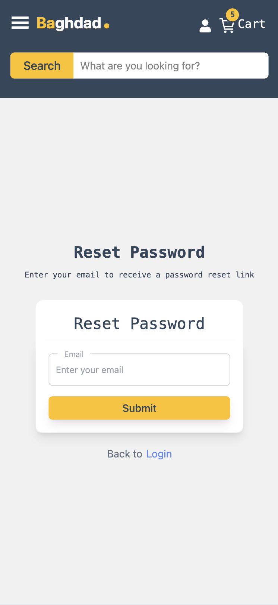 |
|       _Includes Instant Demo Access_       |            _Full Validation (Zod)_            |              _Auth Persistence Logic_               |

---

## 🏗️ Project Structure

```text
src/
├── app/             # Centralized Redux Store & Typed Hooks
├── features/        # Logic Hub (Auth, Products, Cart, Users, Orders)
├── components/      # Reusable UI Atoms (Modal, Input, Button, etc.)
├── layouts/         # Shells (Root, Admin, Profile, Sticky Headers)
├── types/           # Global Domain-driven TypeScript definitions
└── utils/           # Shared Helpers (Price calculators, UI Helpers)
```

---

Developed with precision and passion by **Hossam Gouda**  
_Front-End Engineer focused on building scalable and maintainable web systems._
